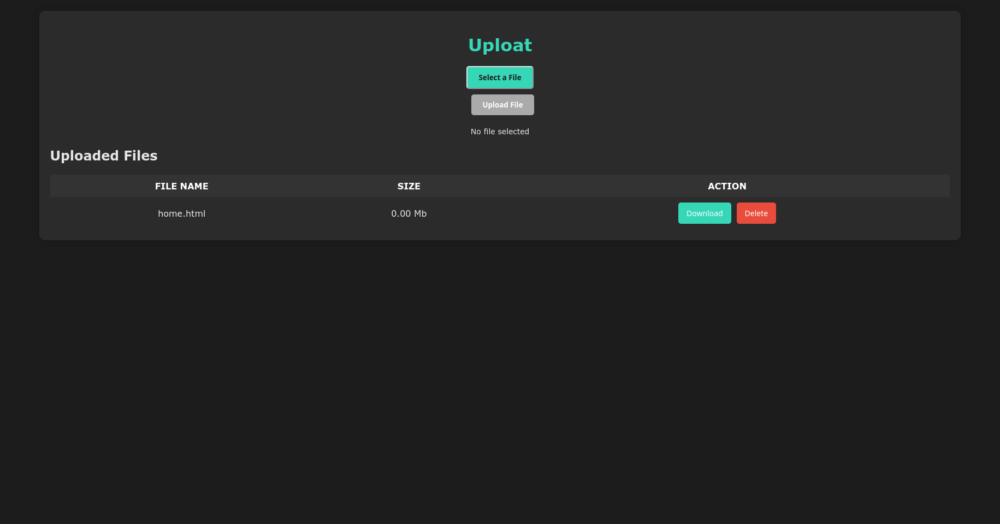

# Uploat
A simple web app to effortlessly transfer files between multiple devices.
This web application allows users to select and upload files, manage uploaded files (download, delete).

## How to use it?

1. **Start the webserver**: `cargo run`
2. **Connect other devices to the same wifi**
3. **Get the local ip address of the device running the server and then open `<local ip address>:8888` on other device(s)**
4. **Select a File**
6. **Upload the File**
7. **Manage Files**: Users can:
   - **Download** a file by clicking the "Download" button next to the file.
   - **Delete** a file by clicking the "Delete" button, which removes the file from the server.

## Screenshot

